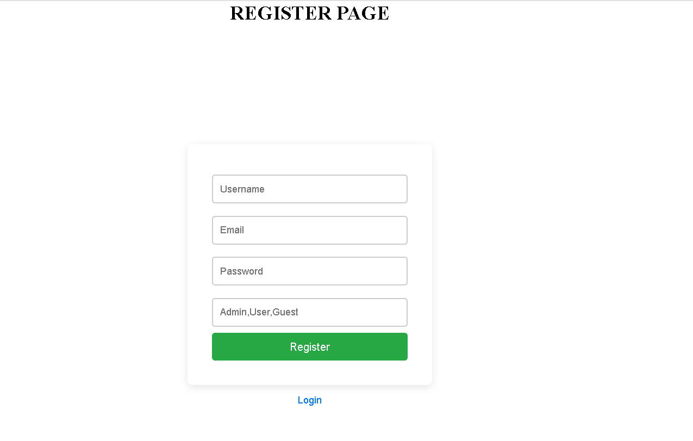
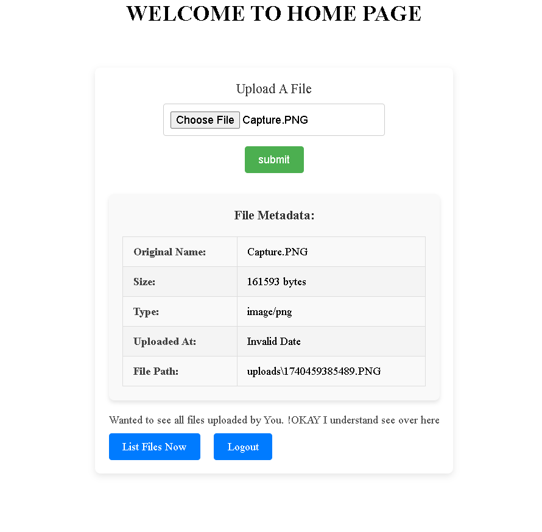
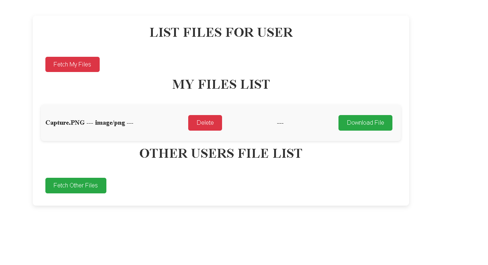

# File Sharing Application

This is a file sharing application that allows users to sign up, log in, upload files, and share those files with other users. It provides a simple and secure way to manage and share your files online.

## Screenshot

**Register Page**

**File Upload Form**

**Listing Files**

## Features

- **Account Signup**: Create a new user account.
- **Sign In**: Log into the application with your credentials.
- **Sign Out**: Securely sign out of your account.
- **JWT Authentication**: Authenticate every request made to backend server
- **File Upload**: Upload files to your account.
- **File Sharing**: Share uploaded files with other registered users.

## Technologies Used

- **Backend**: Nodejs, ExpressJS
- **Frontend**: ReactJS
- **Database**: MongoDB
- **File Storage**: Multer
- **Authentication**: JWT

### Installation

1. Clone the repository:   git clone https://github.com/Chand-007/FileUploadMERN.git
2. Go to ***authfrontend*** folder and run `npm start`
3. Spinup mongoDB Database
4. Add From mail in MailConfig.js file in authbackend folder
5. Add your JWT secret key in authController.js and create a .env file in authbackend folder with JWT_SECRET_KEY
6. Go to ***authbackend*** folder and run `node Server.js`

